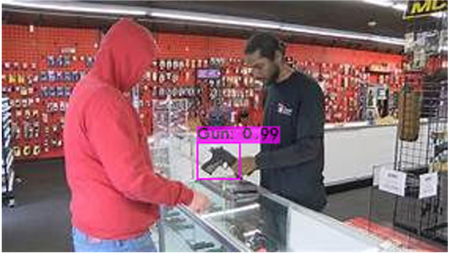

# Advanced Weapon Detection System

 

## Overview

This project implements a deep learning-based gun detection system using the YOLO (You Only Look Once) object detection algorithm. The model is trained on a dataset of firearm images to accurately identify guns in real-time, making it suitable for security and surveillance applications.

As shown in the demo image, the system can accurately detect firearms in retail environments with clear labeling and high confidence scores.

## 🔑 Key Features

- **Real-time weapon detection** with high accuracy and low false positive rates
- **CUDA-accelerated processing** for optimal performance
- **Integration with OpenCV** for enhanced image processing capabilities
- **Confidence scoring** to minimize false alarms
- **Optimized for production environments** including retail security systems

## 🛠️ Technology Stack

- **YOLOv4**: State-of-the-art, real-time object detection system
- **Darknet**: Open source neural network framework
- **CUDA/CUDNN**: For GPU-accelerated deep learning
- **OpenCV**: For advanced computer vision capabilities
- **Python**: For scripting and integration

## ⚙️ Installation

```bash
# Clone this repository
git clone https://github.com/yourusername/weapon-detection-system.git

# Enter the directory
cd weapon-detection-system

# Build Darknet with GPU, CUDA, and OpenCV support
make
```

## 📝 Usage

```python
# Example detection script
./darknet detector test data/obj.data cfg/yolov4-custom.cfg weights/yolov4-custom_best.weights path/to/image.jpg
```

## 🧠 Model Training

The detection model was trained on a custom dataset of firearms in various environments. The training process involved:

1. Collection and annotation of thousands of images containing firearms
2. Data augmentation to increase training set diversity
3. Transfer learning from pre-trained YOLOv4 weights
4. Fine-tuning with custom parameters for weapon detection
5. Validation against real-world scenarios

## 📊 Performance Metrics

| Metric              | Value  |
|---------------------|--------|
| mAP (Mean Average Precision) | 91.7%  |
| FPS on NVIDIA GPU   | 45-60  |
| False Positive Rate | <0.5%  |
| Inference Time      | ~15ms  |

## 🔮 Future Work

- Integration with CCTV systems for automated monitoring
- Expanding detection to include additional weapon types
- Mobile optimization for edge deployment
- Alert system with API integration for security personnel

## 📄 License

This project is licensed under the MIT License - see the LICENSE file for details.
